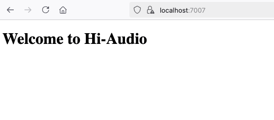

## About

Hi-Audio online platform is a collaborative web application for musicians and researchers in the MIR (Music Information Retrieval) domain, with a view to build a public database of music recordings from a wide variety of styles and different cultures. It allows:

- Creating musical compositions and collections with different levels of privacy.
- Uploading and recording audio tracks from the browser.
- Annotating audio tracks with relevant MIR information.
- Inviting collaborators to participate using different roles.


This repo is a template of the Hi-Audio back-end, which allows to run a simplfied version of the server. The corresponding client side submodule (hiaudio_demoapp) can be found here:

https://github.com/fan-droide/hiaudio_demoapp

For the original client and server sides repositories check the following:

[1] https://github.com/idsinge/hiaudio_webapp

[2] https://github.com/idsinge/hiaudio_backend

## Run the local server. Recommended Python version 3.10

### Clone or download the repository
```bash
git clone --recurse-submodules --remote-submodules https://github.com/fan-droide/hiaudio_template.git

cd hiaudio_template
```
### (Linux and macOS) Create and activate Python environment 
```bash
python3 -m venv venv

. venv/bin/activate
```

### (Windows) Create and activate Python environment 
```bash
python -m venv venv

venv\Scripts\activate
```

### Install requirements
```bash
pip install -r requirements.txt
```

### Create an .env file with the Google OAuth client information
```bash
# Google Values: https://console.cloud.google.com/apis/credentials
# SECRET_KEY is independent and can be self-elected
# JWT_SECRET_KEY: https://flask-jwt-extended.readthedocs.io/en/stable/options.html#JWT_SECRET_KEY
GOOGLE_CLIENT_ID=*****
GOOGLE_CLIENT_SECRET=*****
SECRET_KEY=hiaudio
JWT_SECRET_KEY=b'_5#y2L"F4Q8z\n\xec]/'
```
[More info about creating a Google OAuth 2.0 Client](https://github.com/fan-droide/hiaudio_template/wiki/Create-a-Google-OAuth-2.0-Client)

### Initialize the DB for the first time and run the app:
```bash
python initdb.py

# Run the local server 
python app.py

# Verify it's running
Open -> https://localhost:7007/
```

### At this point you should see the following page:


## To make the frontend repo work together with the backend in local DEV mode/environment (hiaudio_demoapp submodule, see Note 1 for more info), in a different termimal inside the current directory run the following commands:

```bash
cd hiaudio_demoapp

npm i

npm run dev

```

## Keep up to date `hiaudio_demoapp` and `waveform-playlist` submodules:

```bash
git submodule update --recursive --remote --merge
```


**Hint**: during development it might be useful to temporarly ignore the contents of the public directory, this can be done with

```
# ignore public/ contents for git diff, grep, status, etc.
git ls-files -z public/ | xargs -0 git update-index --skip-worktree

# track the contents of public/ again (when commiting changes to it for example)
git ls-files -z public/ | xargs -0 git update-index --no-skip-worktree
```


## NOTES:
1- [Submodule - Demo Web App Repo](https://github.com/fan-droide/hiaudio_demoapp)